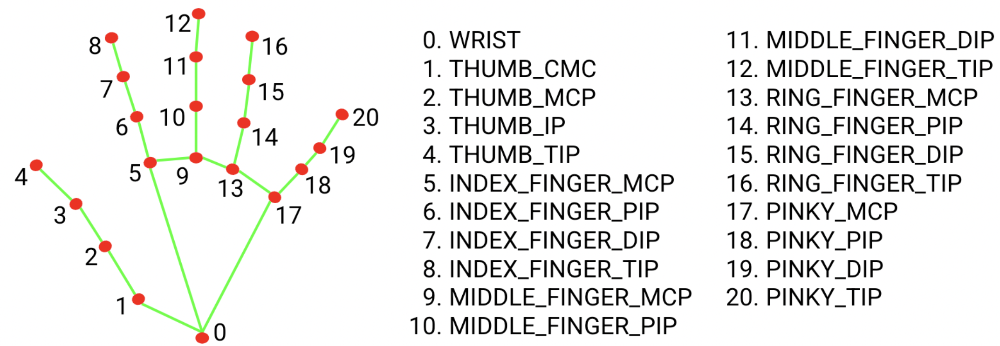
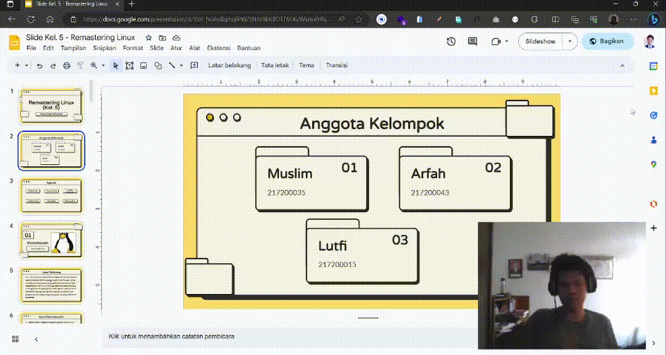

# Hand Tracking PPT Slider

### About
This project is an implementation of a system that controls 
PowerPoint (PPT) slide presentation using computer vision technology, MediaPipe, and PyAutoGUI. 
By leveraging MediaPipe to detect hand landmarks and recognize user gestures, the project enables users to automatically navigate through PPT slides using hand movements. Using PyAutoGUI, the project connects hand gestures with commands to control the arrow keys on the keyboard. That's it. Simple right?

### Libraries that I use
- opencv-python
- mediapipe
- pyautogui

### The hand landmarks

I use only the THUMB_TIP and the THUMB_IP to trigger the arrow

### Test
